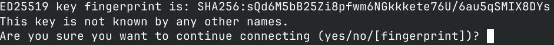
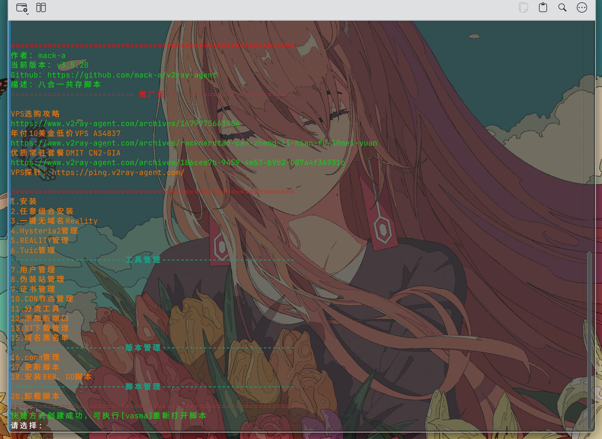
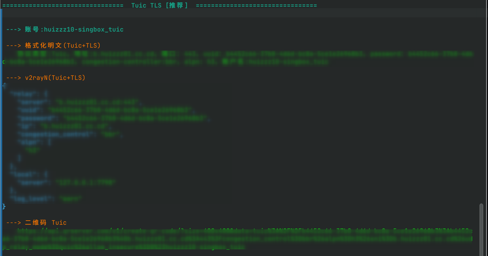

# 为什么要使用 sing-box 构建代理服务

简单来说，Project X 的作者于 2026 年 7 月宣布停止对中国地区的支持。  
为了保证代理服务的可靠性，sing-box 是一个不错的选择。

sing-box 是一个高性能的代理服务框架，支持多种协议和功能，适合构建稳定的代理服务。  
在之前的使用中，sing-box 的表现相当不错。

- Android 设备上使用 KSU 模块 NetProxy，内存占用仅为 26 MB，性能表现非常出色。
- homeproxy 插件是唯一能在我的小米 R3G 上正常运行的，其他插件均无法工作。

话不多说，以下是我使用 sing-box 构建代理服务的完整记录。

# 准备工作

1. 购买 VPS
2. 使用脚本搭建服务
3. 导入节点

# 购买 VPS

我没有什么特别推荐的，主要看你的需求和预算。  
不过一分钱一分货，便宜的 VPS 可能存在不足之处，例如 IP 质量、网络稳定性等。

# 使用脚本搭建

我使用的脚本是 [mack-a 的 v2ray-agent](https://github.com/mack-a/v2ray-agent)。  
详细步骤与常见问题可参考[官方文档](https://www.v2ray-agent.com/archives/1710141233)。

## SSH 连接 VPS

在服务商的面板中找到 VPS 的 IP 地址和密码，然后通过 SSH 连接到 VPS：

```
ssh root@xxx.xxxx.xxx.xxx
```

首次连接会有提示，输入 `yes`，然后输入密码。连接成功后即可进行下一步操作。



## 脚本使用 —— 下载与运行

执行以下命令下载并运行脚本：

```
wget -P /root -N --no-check-certificate "https://raw.githubusercontent.com/mack-a/v2ray-agent/master/install.sh" && chmod 700 /root/install.sh && /root/install.sh
```

脚本界面出现后，我计划搭建 TUIC，因此需要一个域名。可以在 [DNSHE](https://www.dnshe.com/) 注册免费域名。  
申请完成后，使用 Cloudflare 托管并解析你的域名，添加 A 记录指向 VPS 的 IP 地址。  
具体方法可参考：[这篇文章](https://zhuanlan.zhihu.com/p/1990162606653191280)



## 脚本使用 —— 配置步骤

根据脚本提示进行操作，其中涉及 Cloudflare API Token 的使用，可参考[官方文档](https://www.v2ray-agent.com/archives/1701160377972)。  
我的操作步骤如下：

1. 选择「任意组合安装」
2. 选择安装 sing-box
3. 选择 TUIC 协议
4. 输入域名
5. 是否使用 DNS API：选 `y`
6. 选择 Cloudflare
7. 输入 API Token
8. 是否使用 API 申请通配符证书：选 `y`
9. 其余选项保持默认
10. UUID 和用户名：直接回车即可
11. 设置端口：按需填写
12. 选择安装 BBR

至此服务已安装完成。如果不在意 IP 质量，可以直接使用。

# 导入节点

搭建完成后，脚本会立即显示导入连接。如果需要获取订阅链接，输入：

```
vasma
```

根据提示选择相应选项即可。测试一下延迟，若不为 0 则说明可用。



# 结语

搭建到这里即可结束。但如果需要中转，可以参考 AI 的帮助修改配置文件。  
不过我实现中转后，发现使用 Cloudflare Workers 部署的本博客无法访问。  
这个问题也可以通过 AI 帮助修改配置文件解决，似乎与流量嗅探有关。

好，就到这里！

> **使用DeepSeek进行润色**